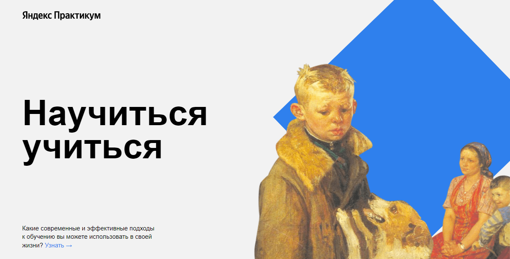
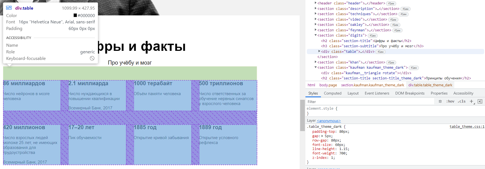
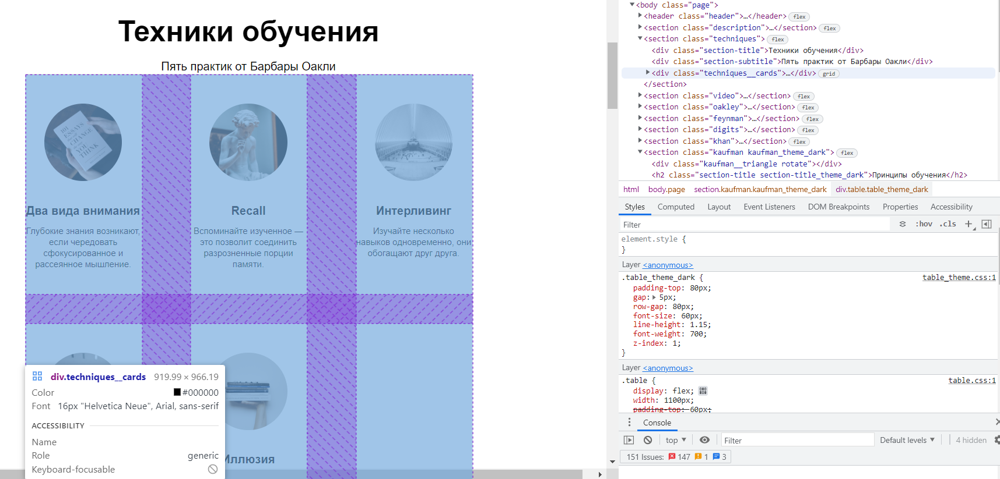
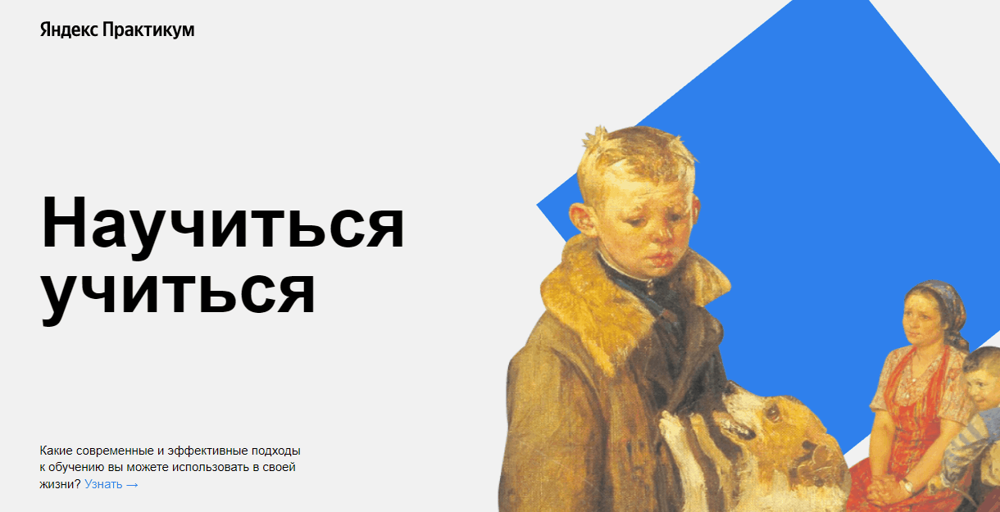
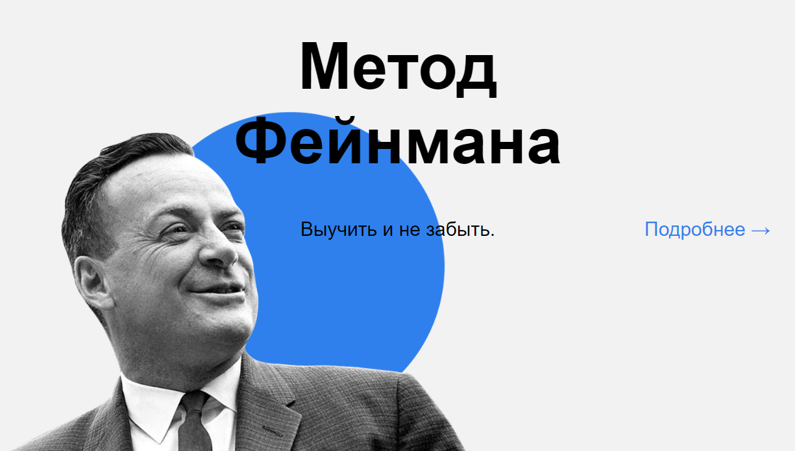

<h1 align="left">Проект №2 от ЯндексПрактикума</h1>

Студент Александр Павлов

## Описание

Второй учебный проект от Яндекс Практикума. Верстка посадочной страницы с разными блоками с использованием БЭМ.

### Используемые технологии
<ul style="list-style:none; padding-left:0;">
  
  <li style="margin-bottom:20px;">Flex</li>
  
  <li style="margin-bottom:20px;">Grid</li>
  
  <li style="margin-bottom:20px;">CSS-анимация</li>
  
  <li style="margin-bottom:20px;">Фоновые изображения с CSS</li>
</ul>

## Планы по доработке проекта
<ul>
<li>Адаптивность</li>
<li>Добавить внутренние страницы проекта</li>
<li>JavaScript-события</li>
<li>Отправка формы обратной связи</li>
</ul>
